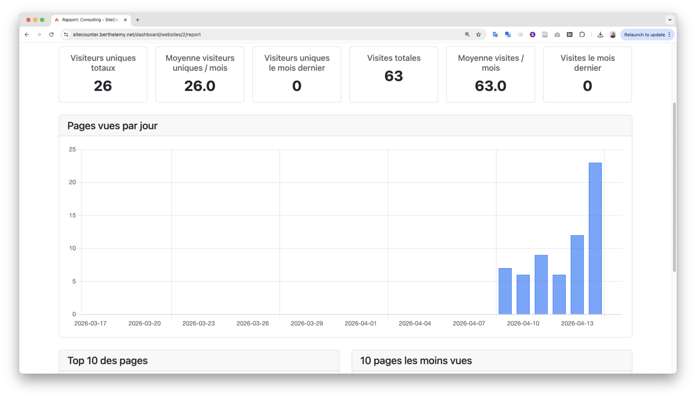

# SiteCounter

SiteCounter is a self-hosted website analytics tracker built with CodeIgniter 4 and Bootstrap 5.
It lets an administrator register websites, install a small tracking snippet, and review visit and unique visitor trends.

## Features

- One-time web installer (SQLite-first for initial public release)
- Authentication with password and magic-link reset flow
- Language support with English and French packs
- Website CRUD with per-site tracking token and copy-ready script
- Tracking endpoint with visitor cookie identifier and CORS handling
- Reporting dashboard with unique visitors, total visits, top pages, bottom pages, and timeline chart

## Tech Stack

- PHP 8.2+
- CodeIgniter 4
- CodeIgniter Shield
- Bootstrap 5 + Bootstrap Icons
- SQLite (default and currently supported installer target)

## Quick Start (Local)

1. Install dependencies:

	cd sitecounter && composer install

2. Create local environment file:

	cp env .env

3. Start development server:

	php spark serve

4. Open installer:

	http://localhost:8080/install

## Shared Hosting Deployment

Use the standard secure layout:

- Keep application files outside web root.
- Copy the contents of sitecounter/public/ into public_html/.
- Keep sitecounter/app/, sitecounter/writable/, sitecounter/vendor/, and other project files outside public_html/.
- Adjust paths in public_html/index.php so framework and app paths resolve correctly.
- Copy sitecounter/env to sitecounter/.env before running the web installer.
- During installation, SiteCounter now auto-detects the current host/path and writes app.baseURL to .env.
- After install, verify app.baseURL in .env matches your final public URL (with trailing slash), especially if you use subfolders or force HTTPS.

## Configuration Notes

- Copy sitecounter/env to sitecounter/.env and set production options before go-live.
- If your host URL is already known, you can pre-set app.baseURL in sitecounter/.env before installation.
- Ensure sitecounter/writable/, sitecounter/writable/cache/, sitecounter/writable/logs/, sitecounter/writable/session/, and sitecounter/writable/uploads/ are writable by the web server user.
- For production, set:

  CI_ENVIRONMENT = production

## Shared Hosting Troubleshooting Checklist

Use this checklist if you are redirected to localhost or see:

- Installation failed: Unexpected token '<', "<!DOCTYPE ..." is not valid JSON

1. Confirm .env location

- File must be at sitecounter/.env (project root), not in public_html/.

2. Confirm app.baseURL in .env

- Set app.baseURL to your real public URL, including trailing slash.
- Example: app.baseURL = 'https://example.com/'
- If deployed in a subfolder, include it.
- Example: app.baseURL = 'https://example.com/stats/'

3. Confirm writable permissions

- During install, sitecounter/.env must be writable so installer can persist settings.
- Runtime folders must be writable: writable/, writable/cache/, writable/logs/, writable/session/, writable/uploads/.

4. Confirm public/index.php path wiring

- Verify public_html/index.php points to the correct app, system, and writable paths outside web root.
- Wrong paths can make the app load the wrong root and miss .env.
- SiteCounter now checks common layouts automatically, but if your host uses a custom layout, set a server env var:
	SITECOUNTER_PATHS=/absolute/path/to/sitecounter/app/Config/Paths.php
- If you cannot set env vars in your host panel, edit public_html/index.php and hardcode the correct Paths.php path.

5. Confirm URL rewriting

- Ensure your host rewrite rules route requests to index.php.
- If rewrite is broken, /install/run can return an HTML error page instead of JSON.

6. Confirm installer endpoint response

- Open browser dev tools Network tab and inspect POST to /install/run.
- If response Content-Type is text/html, fix the server-side error first.
- Check writable/logs for the matching PHP/CodeIgniter error entry.

7. Confirm HTTPS/proxy handling

- Behind a reverse proxy/CDN, ensure forwarded HTTPS headers are set correctly.
- If scheme detection is wrong, app.baseURL may be written as http instead of https.

8. Clear stale cache/session state

- Clear sitecounter/writable/cache/ and retry install.
- Start a fresh browser session if redirects are sticky.

## Running Tests

Run all tests:

cd sitecounter && composer test

or:

cd sitecounter && vendor/bin/phpunit

Coverage reports require Xdebug coverage mode.

## Security

- Installer is one-time and should be inaccessible after successful installation.
- Password minimum length is 8 characters.
- Do not commit .env, local SQLite databases, or writable runtime content.

## Open Source Process

- Contribution process: see CONTRIBUTING.md.
- Release process and tagging: see RELEASE.md.
- Manual acceptance checklist: see sitecounter/tests/MANUAL-ACCEPTANCE.md.

## License

This project is licensed under the GNU General Public License v3.0. See LICENSE.
