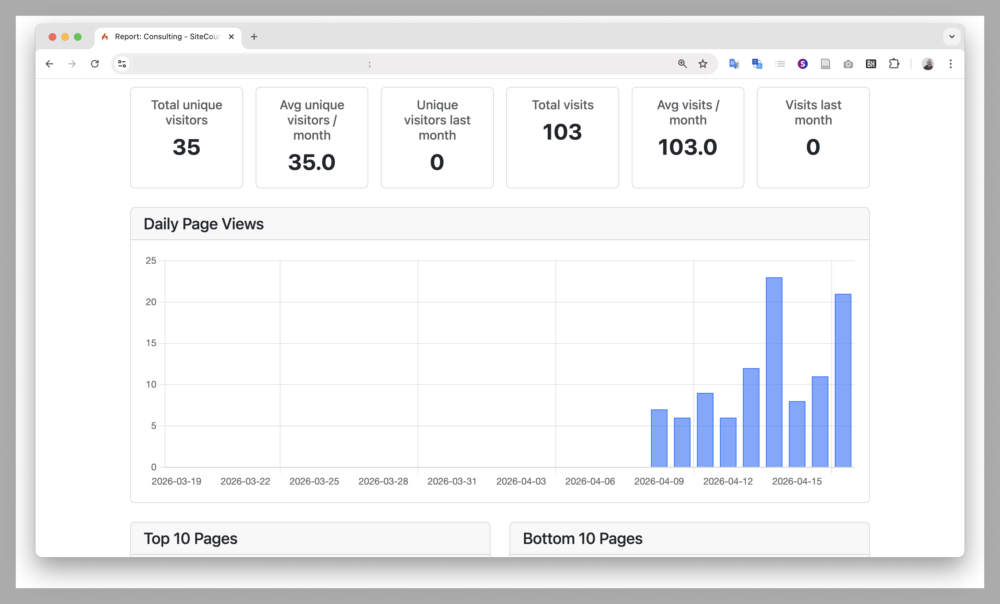

# SiteCounter

SiteCounter is a self-hosted website analytics tracker built with CodeIgniter 4 and Bootstrap 5.
It lets an administrator register websites, install a small tracking snippet, and review visit and unique visitor trends.



## Features

- One-time web installer (SQLite-first for initial public release)
- Authentication with password and magic-link reset flow
- Language support with English and French packs
- Website CRUD with per-site tracking token and copy-ready script
- Tracking endpoint with visitor cookie identifier and CORS handling
- Reporting dashboard with unique visitors, total visits, top pages, bottom pages, and timeline chart

## Tech Stack

- PHP 8.2+
- CodeIgniter 4
- CodeIgniter Shield
- Bootstrap 5 + Bootstrap Icons
- SQLite (default and currently supported installer target)

## Quick Start (Local)

1. Install dependencies:

	cd sitecounter && composer install

2. Create local environment file:

	cp env .env

3. Start development server:

	php spark serve

4. Open installer:

	http://localhost:8080/install

## Shared Hosting Deployment

Use the standard secure layout:

- Keep application files outside web root.
- Copy the contents of sitecounter/public/ into public_html/.
- Keep sitecounter/app/, sitecounter/writable/, sitecounter/vendor/, and other project files outside public_html/.
- Adjust paths in public_html/index.php so framework and app paths resolve correctly (see [Path Resolution in index.php](#path-resolution-in-indexphp) below).
- Copy sitecounter/env to sitecounter/.env before running the web installer.
- During installation, SiteCounter now auto-detects the current host/path and writes app.baseURL to .env.
- After install, verify app.baseURL in .env matches your final public URL (with trailing slash), especially if you use subfolders or force HTTPS.

## Path Resolution in index.php

When `public/index.php` is copied to your web root (`public_html/`), it must locate `app/Config/Paths.php` so the framework can find all other directories.

### How auto-detection works

`index.php` tries three candidate paths in order, stopping at the first one that exists:

| Candidate | Assumed layout |
|-----------|----------------|
| `../app/Config/Paths.php` | `app/` sits directly alongside the web root (folder renamed from `sitecounter/`) |
| `../sitecounter/app/Config/Paths.php` | `sitecounter/` sits one level above the web root — **standard shared-hosting layout** |
| `../../sitecounter/app/Config/Paths.php` | `sitecounter/` sits two levels above the web root (e.g. `domains/example.com/public_html/`) |

For the standard shared-hosting layout your folder tree should look like:

```
/home/user/
├── public_html/          ← web root (contents of sitecounter/public/ go here)
│   ├── index.php
│   ├── robots.txt
│   └── js/
└── sitecounter/          ← application root (outside web root)
    ├── .env
    ├── app/
    ├── vendor/
    └── writable/
```

### What Paths.php controls

Once located, `app/Config/Paths.php` tells the framework where to find three directories. All paths are relative to `Paths.php`'s own location (`app/Config/`) using `__DIR__`, so they resolve correctly as long as `Paths.php` itself is found:

| Property | Default value (relative to `app/Config/`) | Resolves to |
|----------|------------------------------------------|-------------|
| `$systemDirectory` | `../../vendor/codeigniter4/framework/system` | `sitecounter/vendor/codeigniter4/framework/system` |
| `$appDirectory` | `..` | `sitecounter/app/` |
| `$writableDirectory` | `../../writable` | `sitecounter/writable/` |

You only need to edit `Paths.php` if you move those folders to a non-default location.

### When auto-detection fails

If your host uses a different folder structure, choose one of these options **in order of preference**:

**Option A — Set the path in `.env` (recommended — survives git pulls)**

Open `sitecounter/.env` and uncomment/add:

```
SITECOUNTER_PATHS = /home/user/sitecounter/app/Config/Paths.php
```

This is read by `index.php` before the framework loads, so it is never overwritten by a `git pull`. The `env` template includes this key commented out as a reminder.

**Option B — Set a server environment variable**

In your host control panel or `.htaccess`, set:

```
SITECOUNTER_PATHS=/absolute/path/to/sitecounter/app/Config/Paths.php
```

Example `.htaccess` directive:

```apache
SetEnv SITECOUNTER_PATHS /home/user/sitecounter/app/Config/Paths.php
```

**Option C — Add a candidate to index.php**

Open `public_html/index.php` and find the `$candidates` array (look for the comment `Auto-detection: SiteCounter tries the three most common folder layouts`). Add your path as a new entry:

```php
$candidates = [
    FCPATH . '../app/Config/Paths.php',
    FCPATH . '../sitecounter/app/Config/Paths.php',
    dirname(FCPATH, 2) . '/sitecounter/app/Config/Paths.php',
    '/home/user/custom-location/sitecounter/app/Config/Paths.php', // add your path here
];
```

**Option D — Hardcode the path at the top of index.php**

If none of the above options are possible, replace the entire auto-detection block with a single line immediately above the `require $pathsConfig;` call:

```php
$pathsConfig = '/home/user/sitecounter/app/Config/Paths.php';
```

## Configuration Notes

- Copy sitecounter/env to sitecounter/.env and set production options before go-live.
- If your host URL is already known, you can pre-set app.baseURL in sitecounter/.env before installation.
- Ensure sitecounter/writable/, sitecounter/writable/cache/, sitecounter/writable/logs/, sitecounter/writable/session/, and sitecounter/writable/uploads/ are writable by the web server user.
- For production, set:

  CI_ENVIRONMENT = production

## Tracking Cookie and Local Storage Behavior

SiteCounter's client tracker stores two small browser values to manage consent and visitor counting:

- Cookie: `sitecounter_visitor_id`
	- Purpose: stores an anonymous UUID used to count unique visitors.
	- Lifetime: up to 365 days (best effort; browser/privacy settings may shorten or block it).
	- Scope: current site path (`/`).

- Local storage key: `sitecounter_cookie_consent`
	- Values: `allow` or `deny`.
	- Purpose: remembers the visitor's consent choice for the cookie banner.

Consent flow summary:

1. On first visit, no consent value exists, so the banner is shown.
2. If visitor clicks Allow cookie:
	 - `sitecounter_cookie_consent=allow` is saved in localStorage.
	 - `sitecounter_visitor_id` cookie is created (or refreshed) and tracking request is sent.
3. If visitor clicks Decline:
	 - `sitecounter_cookie_consent=deny` is saved.
	 - No visitor cookie is created and no tracking request is sent.

Reset behavior:

- If cookies are deleted but localStorage remains:
	- SiteCounter now asks for consent again before creating a new visitor cookie.
- If localStorage is deleted but cookie remains:
	- Consent banner is shown again, and user must choose Allow/Decline.
- If both are deleted:
	- Behavior is the same as a first-time visitor.

## Shared Hosting Troubleshooting Checklist

Use this checklist if you are redirected to localhost or see:

- Installation failed: Unexpected token '<', "<!DOCTYPE ..." is not valid JSON

1. Confirm .env location

- File must be at sitecounter/.env (project root), not in public_html/.

2. Confirm app.baseURL in .env

- Set app.baseURL to your real public URL, including trailing slash.
- Example: app.baseURL = 'https://example.com/'
- If deployed in a subfolder, include it.
- Example: app.baseURL = 'https://example.com/stats/'

3. Confirm writable permissions

- During install, sitecounter/.env must be writable so installer can persist settings.
- Runtime folders must be writable: writable/, writable/cache/, writable/logs/, writable/session/, writable/uploads/.

4. Confirm public/index.php path wiring

- Verify public_html/index.php points to the correct app, system, and writable paths outside web root.
- Wrong paths can make the app load the wrong root and miss .env.
- SiteCounter checks common layouts automatically, but if your host uses a custom layout the recommended fix is to set `SITECOUNTER_PATHS` in `sitecounter/.env` (see [Path Resolution in index.php](#path-resolution-in-indexphp)).
- This value is read before the framework loads and is never overwritten by a git pull.

5. Confirm URL rewriting

- Ensure your host rewrite rules route requests to index.php.
- If rewrite is broken, /install/run can return an HTML error page instead of JSON.

6. Confirm installer endpoint response

- Open browser dev tools Network tab and inspect POST to /install/run.
- If response Content-Type is text/html, fix the server-side error first.
- Check writable/logs for the matching PHP/CodeIgniter error entry.

7. Confirm HTTPS/proxy handling

- Behind a reverse proxy/CDN, ensure forwarded HTTPS headers are set correctly.
- If scheme detection is wrong, app.baseURL may be written as http instead of https.

8. Clear stale cache/session state

- Clear sitecounter/writable/cache/ and retry install.
- Start a fresh browser session if redirects are sticky.

## Running Tests

Run all tests:

cd sitecounter && composer test

or:

cd sitecounter && vendor/bin/phpunit

Coverage reports require Xdebug coverage mode.

## Security

- Installer is one-time and should be inaccessible after successful installation.
- Password minimum length is 8 characters.
- Do not commit .env, local SQLite databases, or writable runtime content.

## Open Source Process

- Contribution process: see CONTRIBUTING.md.
- Release process and tagging: see RELEASE.md.
- Manual acceptance checklist: see sitecounter/tests/MANUAL-ACCEPTANCE.md.

## License

This project is licensed under the GNU General Public License v3.0. See LICENSE.
